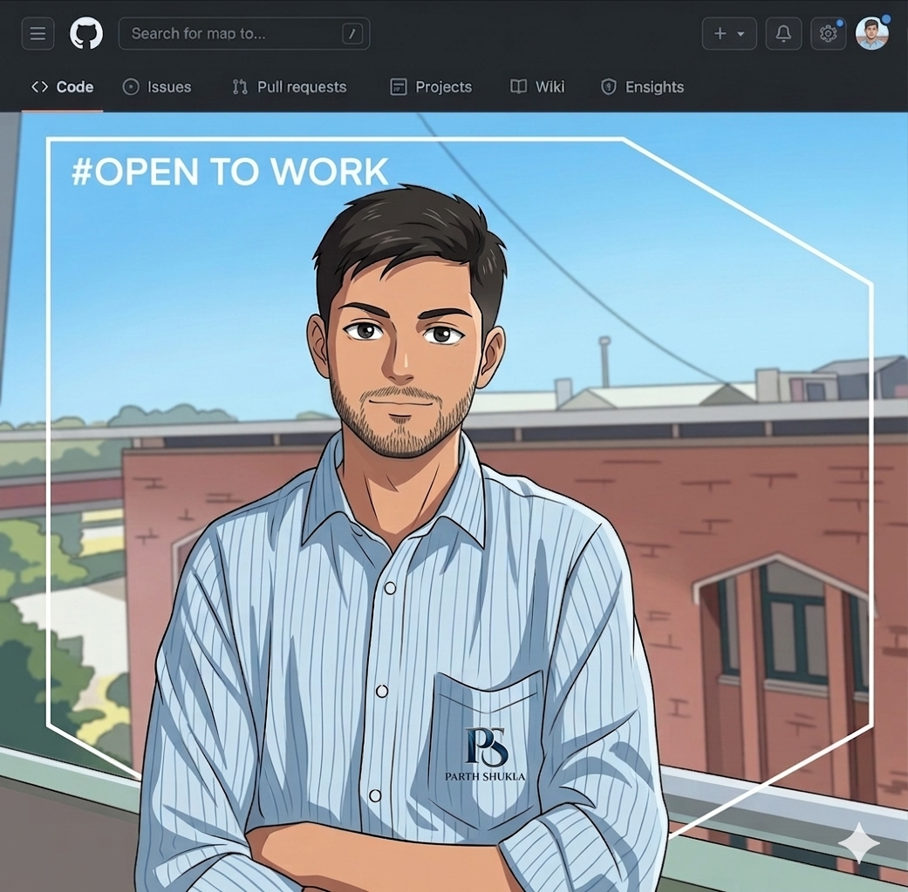

  

# Hi, I'm Parth Shukla 👋

  
  **Innovative AI/ML Engineer | Web Developer | Problem Solver**
  
  
  
  
  
  

---

## 🙋‍♂️ About Me

- 🔭 Currently working on **AI-driven projects (Legal Chatbot & Yoga AI)**
- 🌱 Learning **React, Next.js, and Advanced Machine Learning**
- 👯 Open to collaborating on **AI/ML and full-stack web apps**
- 💬 Ask me about **Python, Machine Learning, Web Development, DSA**
- 📫 Reach me at **2k23.psitaiml2310215@gmail.com**
- ⚡ Fun fact: **I love solving coding challenges & hackathon problems** 🚀

---

## 🛠️ Languages and Tools

### Programming Languages

### Frontend Development

### Backend Development

### Database

### AI/ML & Data Science

### Tools & Technologies

---

## 🚀 Featured Projects

### 🤖 AI & Machine Learning Projects

<table>
<tr>
<td width="50%">

#### 🎓 EduGuide AI
AI-powered assistant for BTech students providing personalized learning guidance.

**Tech Stack:** `Python` `Machine Learning` `NLP`

[🔗 Repository](https://github.com/Parth-ctrl490/EduGuide-AI)

</td>
<td width="50%">

#### 🗣️ Echo AI Voice Assistant
Personal AI assistant using Python and NLP for voice interactions.

**Tech Stack:** `Python` `Speech Recognition` `NLP`

[🔗 Repository](https://github.com/Parth-ctrl490/Echo-Assistant)

</td>
</tr>
<tr>
<td width="50%">

#### ♻️ Plastic Waste Tracker
YOLOv8 AI-powered object detection project for tracking plastic waste.

**Tech Stack:** `Python` `YOLOv8` `Computer Vision`

[🔗 Repository](https://github.com/Parth-ctrl490/plastic-waste-tracker)

</td>
<td width="50%">

#### 🗳️ Vote Buddy
Personalized election assistant with AI chatbot and polling information.

**Tech Stack:** `Python` `AI Chatbot` `Web Development`

[🔗 Repository](https://github.com/Parth-ctrl490/team-project)

</td>
</tr>
</table>

### 💻 Web Development Projects

<table>
<tr>
<td width="50%">

#### 📚 Online Bookstore
Full-featured online bookstore with cart system and user authentication.

**Tech Stack:** `HTML` `CSS` `JavaScript` `Local Storage`

[🔗 Repository](https://github.com/Parth-ctrl490/bookstore)

</td>

</tr>
</table>

### ☕ Java Projects

<table>
<tr>
<td width="33%">

#### 📖 Java Tutorial
Core Java examples, loops, recursion, arrays, and methods with comprehensive tutorials.

[🔗 Repository](https://github.com/Parth-ctrl490/Tutorial)

</td>

<td width="33%">

#### 🎯 OOP in Java
Learn classes, inheritance, polymorphism, and encapsulation with practical examples.

[🔗 Repository](https://github.com/Parth-ctrl490/OOPS-in-Java)

</td>
<td width="33%">

#### 🔍 Java DSA
Data Structures & Algorithms: sorting, searching, stacks, queues, linked lists, hash maps.

[🔗 Repository](https://github.com/Parth-ctrl490/DataStructures)

</td>
</tr>
</table>

### 🗄️ Database Projects

#### 🦕 MongoDB Dinosaur Operations
CRUD operations, aggregation, joins, and schema validation practice with MongoDB.

**Tech Stack:** `MongoDB` `Database Design` `Aggregation Pipelines`

[🔗 Repository](https://github.com/Parth-ctrl490/MongoDB)

---

## 📊 GitHub Statistics

### 📈 Profile Stats

### 🔥 Contribution Streak

### 📊 Most Used Languages

---

## 🏆 GitHub Trophies

---

## 📈 Contribution Graph

---

## 🌐 Connect with Me

---

## 📊 Visitor Count

**Thanks for visiting my profile! ⭐ Star some repositories if you find them interesting!**

---

## 💡 Fun Fact

*"Code is like humor. When you have to explain it, it's bad."* – Cory House 😄

I love building **AI, Web, and Full Stack projects**, exploring **new technologies**, and constantly learning **emerging tech trends**.

**Let's build something amazing together!** 🚀

---

---

### 🐍 Watch my contribution graph get eaten by the snake 🐍

<picture>
  <source media="(prefers-color-scheme: dark)" srcset="https://raw.githubusercontent.com/Parth-ctrl490/Parth-ctrl490/output/github-contribution-grid-snake-dark.svg">
  <source media="(prefers-color-scheme: light)" srcset="https://raw.githubusercontent.com/Parth-ctrl490/Parth-ctrl490/output/github-contribution-grid-snake.svg">
  
</picture>

---

⭐ **Thanks for visiting my profile!** ⭐

**Star some repositories if you find them interesting!** 🌟

